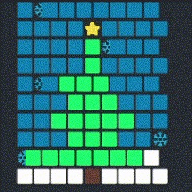
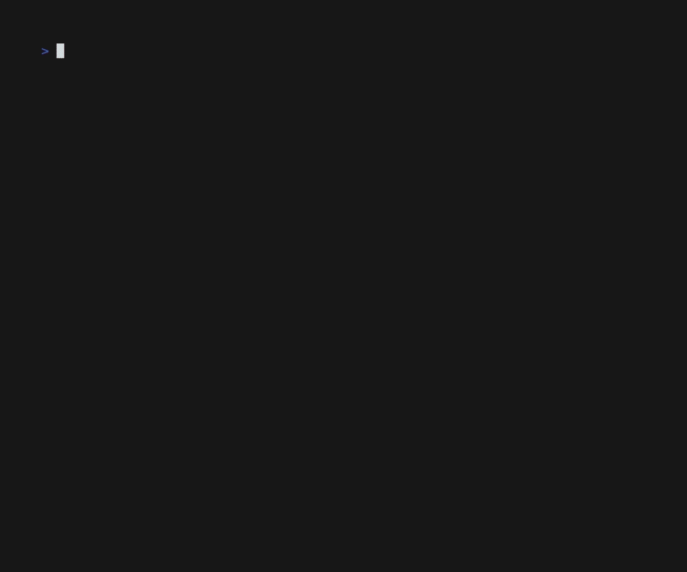

# review-ssh

A terminal user-interface for `review-api` over ssh

## Ahoy!

All ye brave souls who wish to delve within this repo, heed me warnings three!

- I be new to Go and this be me maiden voyage.
  - This is my first project with go, so I don't understand best practices, and I'm more concerned with a working app.
- [@charmbracelet/soft-serve](https://github.com/charmbracelet/soft-serve) be the siren I follow, but bountiful booty or the depths of the sea, where does it lead?
  - Bubble tea is a nice framework for terminal user interfaces (TUI) using Go, but that doesn't mean ANYONE should write TUI apps in Go. It's still very non-ergonomic and I don't think it scales well with more complex apps with deeply nested views. The [component library](https://github.com/charmbracelet/bubbles) can be annoying to work with since the components don't implement any common interface. Go can be overly verbose and also segfault without helpful errors.
- Ye must lose your landlubber ways if ye wish to conquer these high seas!
  - Talk like a pirate.

### Things of note

You may see this and wonder why ignore the first arg of Update()?

```go
_, cmd := child.Update(msg)
```

I opted to only work with struct pointers to avoid type assertions everywhere like below.

```go
// type MyModel struct {
//   child child.Model
// }
// func (m *MyModel) Update(msg tea.Msg) (tea.Model, tea.Cmd)  {
//...

model, cmd := child.Update(msg)
m.child = model.(child.Model)
```

The bubbles components avoid the type assertions by having a Update() function with a specific return type. This makes them hard to work with (like in lists), and I ended up creating wrapper components in some cases.

## Scaffold new component

```go
import (
	tea "github.com/charmbracelet/bubbletea"
	"github.com/zhengkyl/review-ssh/ui/common"
)

type Model struct {
	common  common.Common
	focused bool
}

func New(c common.Common) *Model {
	return &Model{
		common: c,
		focus: false,
	}
}

func (m *Model) Focused() bool {
	return m.focused
}

func (m *Model) Focus() tea.Cmd {
	m.focused = true
	return nil
}

func (m *Model) Blur() {
	m.focused = false
}

func (m *Model) SetSize(h, w int) {

}

func (m *Model) Height() int {
	return m.common.Height
}

func (m *Model) Width() int {
	return m.common.Width
}

func (m *Model) Init() tea.Cmd {
	return nil
}

func (m *Model) Update(msg tea.Msg) (tea.Model, tea.Cmd) {
	return m, nil
}

func (m *Model) View() string {
	return ""
}
```

## Progress

### 2/25/23

- move between input fields


### 2/11/23

- toggle between multiple pages
- functionless buttons for each movie in list


### 2/3/23

- made list of movies pretty


### 1/28/23

- got images loading in a jank way



### 12/23/22

- colors are sooo fun and quirky


### 12/22/22

- colors are sooo fun and quirky



### 12/21/22

- http requests keep failing?
- parsing json is a pain?
- the terminal is not a good user interface?! 😳


## Resources

https://github.com/charmbracelet/bubbletea

https://github.com/charmbracelet/soft-serve

https://github.com/charmbracelet/lipgloss

https://github.com/charmbracelet/wish
