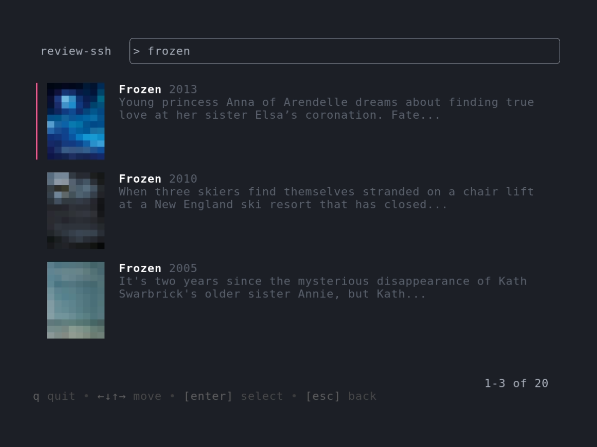

# review-ssh

A minimalist terminal app to review movies. Frontend for [`review-api`](https://github.com/zhengkyl/review-api). Try it at `ssh reviews.kylezhe.ng`

UI built using [`bubbletea`](https://github.com/charmbracelet/bubbletea) and images captured with [`vhs`](https://github.com/charmbracelet/vhs).

## Demo


## Movie review/watchlist


## Search (powered by [TMDB](https://www.themoviedb.org))



## Image, summary, and minimalist rating system


## Development

This is my first project with Go so I made questionable choices.

Here are problems I struggled to solve and should probably be completely redone.

- Async stuff like fetching data and then performing a callback.
- Handling key events and focus across nested components.
- Reusable components. I ended up with a lot of makeshift spaghetti code. At the same time, I overgeneralized too early (see unused vscroll component).

### Notes

I opted to only work with struct pointers for components.

```go
_, cmd := child.Update(msg)
```

This was to avoid type assertions everywhere like below.

```go
// type MyModel struct {
//   child child.Model
// }
// func (m *MyModel) Update(msg tea.Msg) (tea.Model, tea.Cmd)  {
//...

model, cmd := child.Update(msg)
m.child = model.(child.Model)
```

## Scaffold new component

```go
import (
	tea "github.com/charmbracelet/bubbletea"
	"github.com/zhengkyl/review-ssh/ui/common"
)

type Model struct {
	props 	common.Props
	focused bool
}

func New(p common.Props) *Model {
	return &Model{
		props: p,
		focused: false,
	}
}

func (m *Model) Focused() bool {
	return m.focused
}

func (m *Model) Focus() {
	m.focused = true
}

func (m *Model) Blur() {
	m.focused = false
}

func (m *Model) SetSize(width, height int) {

}

func (m *Model) Update(msg tea.Msg) (common.Model, tea.Cmd) {
	return m, nil
}

func (m *Model) View() string {
	return ""
}
```
